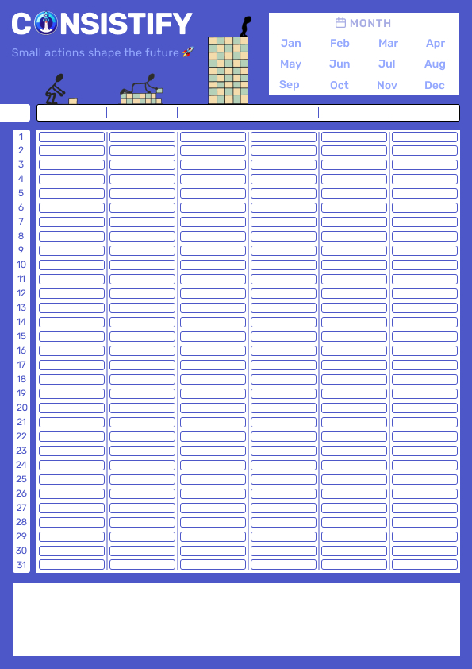
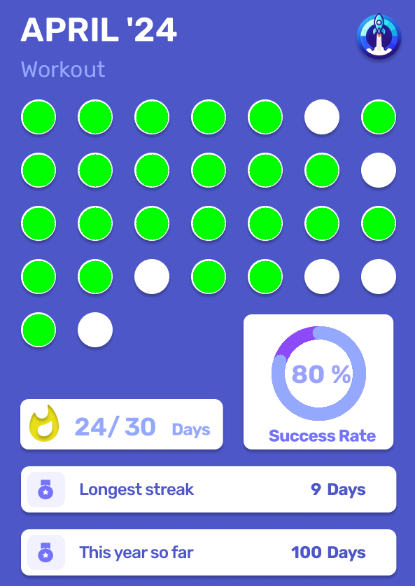
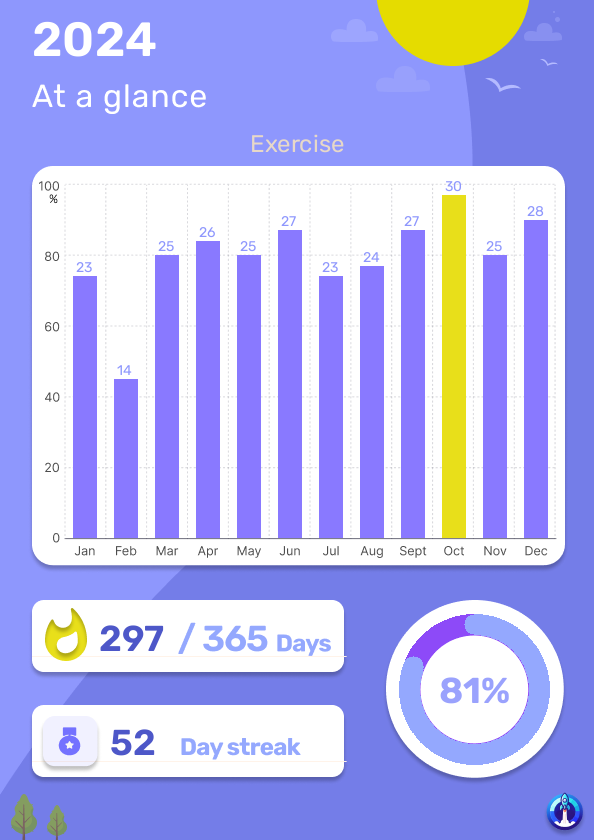

# **Consistify - Habit Tracking and Analysis App**

Consistify is a streamlined habit-tracking app designed to help you stay consistent and achieve your goals. With Consistify, you can easily upload habit tracking templates, view monthly and yearly insights, and take control of your progress—all while ensuring your data privacy and security.


**Check the deployed app:** [consistify.streamlit.app](https://consistify.streamlit.app)

---

## **Features**

- **Effortless Habit Tracking**: Upload a completed habit tracking template and let the app analyze your data.
- **Detailed Insights**:
  - **Monthly Insights**: Track your habit completion rates and streaks for each month.
  - **Yearly Trends**: Get a bird's-eye view of your habits over the entire year.
- **Data Control**:
  - View, manage, and delete your data for specific months, years, or your entire account.
  - Secure authentication via Firebase.
- **Privacy Focused**:
  - Sensitive information (like passwords) is never stored.
  - Data is used exclusively for generating habit insights.

---

## **Tech Stack**

- **Frontend**: [Streamlit](https://streamlit.io/)
- **Backend**: Python, Firebase Firestore (for storing habit data)
- **Authentication**: Firebase Authentication (email-based)
- **Image Processing**: OpenCV, PIL
- **Deployment**: Streamlit Cloud

---

## **Installation and Setup**

### **Prerequisites**
1. Python 3.7 or above
2. Firebase project setup with:
   - Firestore database
   - Firebase Authentication enabled
3. Streamlit Cloud account (optional, for deployment)

### **Steps to run consistify locally**
1. Clone the repository:
   ```bash
   git clone https://github.com/manavthakkar/consistify.git
   cd consistify
   ```

2. Install dependencies:
   ```bash
   pip install -r requirements.txt
   ```

3. Configure Firebase:
   - Create a `.streamlit/secrets.toml` file in the project directory with your Firebase API key obtained from the firebase console:
     ```toml
     FIREBASE_WEB_API_KEY = "your-firebase-web-api-key"
     ```

4. Run the app:
   ```bash
   streamlit run Home.py
   ```

---

## **Usage**

1. **Login/Sign Up**:
   - Use your email to create an account or log in securely.
2. **Upload Template**:
   - Upload a filled habit tracking template (image file).
3. **View Insights**:
   - Explore detailed monthly or yearly analyses.
4. **Manage Data**:
   - Delete specific months, years, or all your data from the "Clear Data" page.

---

### Template


### Monthly Insights


### Yearly Insights


---

## **Contact**

For questions, suggestions, or feedback, feel free to reach out:
- [**Email**](mailto:manavt2000@gmail.com)
- [**LinkedIn**](https://www.linkedin.com/in/manavt2000)


## References
This app is developed on top of the hardwork and contributions of many people and resources. Here is a list of resources i used to develop this app:
- [OPTICAL MARK RECOGNITION (OMR) MCQ Automated Grading- OpenCV Python](https://www.youtube.com/watch?v=0IqCOPlGBTs)
- [Figma Tutorial for Beginners (2024)](https://www.youtube.com/watch?v=ezldKx-jPag)
- [Streamlit documentation](https://docs.streamlit.io/)
- Inspiration for the UI: [Habit Tracker App by Adil Zaman](https://www.figma.com/community/file/1161569654111587208/habit-tracker-app)
- [Streamlit + Firebase Authentication](https://github.com/cmayoracurzio/streamlit_firebase_auth)